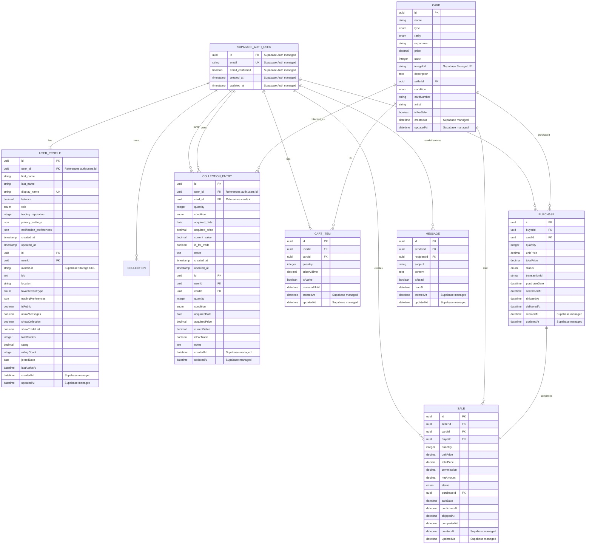

# Database Entities (Supabase PostgreSQL)

The entities represent the main data models of the Pokemon Card Marketplace system. Each entity defines the structure, properties, and relationships of objects managed by the application using Supabase PostgreSQL with Row Level Security (RLS).

**Important Note:** User authentication and core user data is managed by Supabase Auth (`auth.users` table). Extended user information is stored in the `user_profiles` table that references Supabase Auth users.

## 📋 Entity List

| Entity | File | Description | Implementation |
|---------|---------|-------------|---------------------|
| **User** | [user.entity.yaml](./user.entity.yaml) | Core user data (managed by Supabase Auth) | `User.ts` - Auth entity |
| **UserProfile** | [user_profile.entity.yaml](./user_profile.entity.yaml) | Extended user profile information | `UserProfile.ts` - Profile data entity |
| **Card** | [card.entity.yaml](./card.entity.yaml) | Pokemon cards available for trading | `Card.ts` - Product entity |
| **CollectionEntry** | [collection.entity.yaml](./collection.entity.yaml) | Individual card entries in user collections | `CollectionEntry.ts` - Collection item entity |
| **CartItem** | [cart_item.entity.yaml](./cart_item.entity.yaml) | Shopping cart items | `CartItem.ts` - Transient entity |
| **Purchase** | [purchase.entity.yaml](./purchase.entity.yaml) | Purchase transactions | `Purchase.ts` - Transaction entity |
| **Sale** | [sale.entity.yaml](./sale.entity.yaml) | Sale transactions | `Sale.ts` - Transaction entity |
| **Message** | [message.entity.yaml](./message.entity.yaml) | Private messages between users | `Message.ts` - Communication entity |

## Domain Model Overview

The domain entities are implemented following **Domain-Driven Design (DDD)** principles with clear separation between:

### 🔐 **Authentication Layer (Supabase Auth)**
- **User**: Core authentication data managed by Supabase Auth
- Handles: email, password, verification, sessions

### 👤 **Business Layer (Our Domain)**  
- **UserProfile**: Extended user information and business logic
- **CompleteUser**: Aggregate that combines auth + profile data
- Handles: business rules, validation, domain logic

### 🎴 **Trading Layer**
- **Card**: Pokemon card master data
- **Collection**: Named collections of cards
- **CollectionEntry**: Individual card ownership records
- **Sale**: Cards available for purchase
- **CartItem**: Shopping cart line items
- **Purchase**: Completed transactions
- **Message**: User communication

## Entity Relationships (Updated Schema)



## Key Design Decisions (Supabase Integration)

### 1. **Supabase Auth Integration**
- **Primary Authentication**: Leverages Supabase Auth for user management
- **Extended User Data**: Custom User table linked to Supabase Auth users
- **Session Management**: Automatic JWT token handling and refresh
- **Security**: Built-in email verification and password recovery

### 2. **Row Level Security (RLS)**
- **Data Isolation**: Users can only access their own data
- **Policy-Based Access**: Granular permissions using Supabase RLS policies
- **Role-Based Security**: Different access levels for buyers, sellers, admins
- **Real-time Security**: RLS applies to real-time subscriptions

### 3. **Separate Purchase and Sale Entities**
- **Purchase**: Tracks buyer perspective and payment flow
- **Sale**: Tracks seller perspective and commission handling
- **Relationship**: Each Purchase creates a corresponding Sale
- **Consistency**: Maintained through database triggers and Edge Functions

### 4. **Collection vs Cart Separation**
- **Collection**: Long-term ownership of cards with analytics
- **CartItem**: Temporary shopping cart with expiration and reservation
- **Real-time Updates**: Both support live updates via Supabase Realtime

### 5. **User Profile Extension**
- **User**: Core business data linked to Supabase Auth
- **UserProfile**: Social features, preferences, and public information
- **File Storage**: Avatar images stored in Supabase Storage

### 6. **Card Image Management**
- **Supabase Storage**: Secure, scalable file storage for card images
- **CDN Integration**: Automatic image optimization and delivery
- **Access Control**: Image access controlled via RLS policies

### 7. **Real-time Features**
- **Messaging**: Live chat using Supabase Realtime
- **Inventory Updates**: Real-time stock changes
- **Notifications**: Live transaction and activity updates

## Supabase Implementation Notes

### Database Schema Creation
```sql
-- Enable UUID extension
CREATE EXTENSION IF NOT EXISTS "uuid-ossp";

-- Enable RLS on all tables
ALTER TABLE users ENABLE ROW LEVEL SECURITY;
ALTER TABLE user_profiles ENABLE ROW LEVEL SECURITY;
ALTER TABLE cards ENABLE ROW LEVEL SECURITY;
-- ... etc for all tables
```

### Row Level Security Policies
```sql
-- Users can only see their own data
CREATE POLICY "Users can view own data" ON users
  FOR SELECT USING (auth.uid() = id);

-- Users can update their own data
CREATE POLICY "Users can update own data" ON users
  FOR UPDATE USING (auth.uid() = id);
```

### Edge Functions Use Cases
- **Payment Processing**: Secure transaction handling
- **Email Notifications**: Transaction confirmations and updates
- **Commission Calculations**: Automated seller fee processing
- **Data Validation**: Complex business rule enforcement
- **Third-party Integrations**: External payment gateways

### Real-time Subscriptions
```javascript
// Real-time messaging
supabase
  .channel('messages')
  .on('postgres_changes', 
    { event: 'INSERT', schema: 'public', table: 'messages' },
    (payload) => handleNewMessage(payload)
  )
  .subscribe()
```

### Storage Configuration
- **Bucket**: `card-images` for card photographs
- **Bucket**: `user-avatars` for profile pictures
- **Security**: RLS policies on storage objects
- **Optimization**: Automatic image resizing and format conversion

## Validation Standards (Supabase Integration)

All entities include:
- ✅ Primary key (UUID, Supabase managed)
- ✅ Required field validation (database constraints)
- ✅ Data type constraints (PostgreSQL types)
- ✅ Business rule documentation
- ✅ Relationship definitions (foreign keys)
- ✅ Appropriate indexes (PostgreSQL indexes)
- ✅ Timestamps for audit trail (Supabase managed)
- ✅ Row Level Security policies
- ✅ Real-time subscription compatibility

## Business Rules Summary (Supabase Implementation)

### Security & Privacy
- Email verification required for selling (Supabase Auth)
- Message content sanitization (Edge Functions)
- Profile visibility controls (RLS policies)
- User activity tracking (database triggers)

### Trading Logic
- Stock validation for purchases (database constraints + Edge Functions)
- Price freezing in cart (temporary reservations)
- Commission calculation for sales (Edge Functions)
- Automatic status progression (database triggers)

### Data Integrity
- Unique constraints where needed (PostgreSQL)
- Referential integrity with foreign keys
- Cascade deletion policies (PostgreSQL)
- Audit trails with timestamps (Supabase managed)

## Usage Guidelines (Supabase Development)

1. **Database Development**: Use Supabase CLI for local development and migrations
2. **API Design**: Leverage auto-generated Supabase APIs with custom Edge Functions
3. **Validation**: Implement business rules as RLS policies and database functions
4. **Testing**: Use Supabase local development for comprehensive testing
5. **Documentation**: Keep entity docs updated with schema migrations

## Naming Conventions (Supabase Compatible)

### Tables
- Pattern: `{entity_name}` (plural for collections)
- Use lowercase with underscores: `user_profiles`, `cart_items`

### Fields
- Use `camelCase` or `snake_case` (consistent throughout)
- Primary keys: `id` (UUID)
- Foreign keys: `{entity}_id`
- Timestamps: `created_at`, `updated_at` (Supabase convention)
- Booleans: `is_{property}`, `has_{property}`, `allow_{property}`

### Enums
- Use `snake_case` for enum values
- Example: `near_mint`, `ultra_rare`
