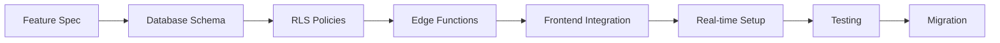

# Pokemon Card Trading System - Feature Specifications (Supabase Architecture)

This directory contains comprehensive Gherkin feature specifications for the Pokemon card trading platform built with Supabase as the complete backend solution.

## Feature Categories

### 🔐 Authentication & User Management (Supabase Auth)
| Feature | File | Description | Supabase Integration |
|---------|------|-------------|---------------------|
| **User Registration** | [user_account_creation.feature](./user_account_creation.feature) | Account creation with email verification | Supabase Auth + custom user table |
| **User Login** | [user_login.feature](./user_login.feature) | Authentication and session management | Supabase Auth with JWT tokens |
| **Password Recovery** | [password_recovery.feature](./password_recovery.feature) | Password reset functionality | Supabase Auth email templates |
| **Profile Management** | [view_edit_user_profile.feature](./view_edit_user_profile.feature) | User profile viewing and editing | RLS policies + Supabase Storage |
| **Account Balance** | [manage_account_balance.feature](./manage_account_balance.feature) | Balance management and transactions | Edge Functions for payment processing |

### 🃏 Card Catalog & Discovery (Supabase Database + Storage)
| Feature | File | Description | Supabase Integration |
|---------|------|-------------|---------------------|
| **Card Catalog** | [view_card_catalog.feature](./view_card_catalog.feature) | Browse available cards with filtering | PostgreSQL queries with pagination |
| **Card Search** | [search_cards.feature](./search_cards.feature) | Search cards by various criteria | Full-text search with database functions |
| **Card Details** | [view_card_details.feature](./view_card_details.feature) | Detailed card information and actions | PostgreSQL with Supabase Storage images |

### 🛒 Shopping & Purchases (Supabase Database + Edge Functions)
| Feature | File | Description | Supabase Integration |
|---------|------|-------------|---------------------|
| **Add to Cart** | [add_card_to_cart.feature](./add_card_to_cart.feature) | Shopping cart functionality | RLS policies for user-specific carts |
| **Remove from Cart** | [remove_card_from_cart.feature](./remove_card_from_cart.feature) | Cart item removal and management | Real-time updates with optimistic UI |
| **Purchase Process** | [purchase_cards_from_cart.feature](./purchase_cards_from_cart.feature) | Complete purchase transactions | Edge Functions for payment processing |

### 💰 Selling & Marketplace (Supabase Database + Storage)
| Feature | File | Description | Supabase Integration |
|---------|------|-------------|---------------------|
| **Sell Cards** | [sell_cards.feature](./sell_cards.feature) | List cards for sale with management | Image upload to Supabase Storage |

### 📦 Collection Management (Supabase Database)
| Feature | File | Description | Supabase Integration |
|---------|------|-------------|---------------------|
| **View Collection** | [view_card_collection.feature](./view_card_collection.feature) | Personal collection management | RLS for user-specific collections |
| **Add to Collection** | [add_cards_to_collection.feature](./add_cards_to_collection.feature) | Add cards to personal collection | Automatic after purchase completion |

### 💬 Communication (Supabase Realtime)
| Feature | File | Description | Supabase Integration |
|---------|------|-------------|---------------------|
| **Send Messages** | [send_private_messages.feature](./send_private_messages.feature) | Private messaging between users | Real-time messaging with live updates |
| **Manage Messages** | [manage_private_messages.feature](./manage_private_messages.feature) | Message organization and management | Real-time subscriptions for notifications |

### 📊 Transaction History (Supabase Database)
| Feature | File | Description | Supabase Integration |
|---------|------|-------------|---------------------|
| **Purchase & Sales History** | [view_purchase_sales_history.feature](./view_purchase_sales_history.feature) | Complete transaction tracking | RLS policies for user-specific history |

## Coverage Summary (Supabase Architecture)

### 🎯 Core User Journeys Covered
- **New User Registration** → Supabase Auth verification → Profile setup → First purchase
- **Browse & Search** → PostgreSQL queries → Add to cart → Edge Function payment
- **Seller Journey** → Image upload to Storage → Manage listings → Real-time sales
- **Collection Building** → Track cards → RLS-secured collections → Analytics
- **Communication** → Real-time messaging → Live notifications → Message management

### ✅ Feature Completeness (Supabase Integration)
- **Authentication**: Complete (Supabase Auth with email verification)
- **Card Management**: Complete (PostgreSQL + Storage + full-text search)
- **Shopping**: Complete (RLS cart + Edge Function payments)
- **Collection**: Complete (RLS-secured + analytics + real-time updates)
- **Communication**: Complete (Supabase Realtime messaging)
- **Account Management**: Complete (Auth + custom profiles + Storage)

### 🔍 Cross-Feature Integration (Supabase Features)
- **Cart Integration**: RLS policies ensure users only see their cart
- **Collection Integration**: Database triggers auto-add purchased cards
- **Messaging Integration**: Real-time subscriptions for live chat
- **Balance Integration**: Edge Functions handle secure payment processing
- **History Integration**: RLS policies secure transaction history access

## Supabase-Specific Implementation Notes

### 🔐 Row Level Security (RLS) Policies
```sql
-- Example: Users can only access their own cart items
CREATE POLICY "Users can view own cart" ON cart_items
  FOR SELECT USING (auth.uid() = user_id);

-- Example: Users can only update their own profile
CREATE POLICY "Users can update own profile" ON user_profiles
  FOR UPDATE USING (auth.uid() = user_id);
```

### ⚡ Real-time Features
- **Live Messaging**: Instant message delivery and read receipts
- **Inventory Updates**: Real-time stock changes across all users
- **Transaction Notifications**: Live updates for purchases and sales
- **Cart Synchronization**: Multi-device cart synchronization

### 📁 Storage Integration
- **Card Images**: Secure upload and CDN delivery
- **User Avatars**: Profile image management with automatic resizing
- **Access Control**: Storage RLS policies for secure file access

### 🔧 Edge Functions Use Cases
- **Payment Processing**: Secure transaction handling with external payment gateways
- **Email Notifications**: Custom email templates for transactions and updates
- **Data Validation**: Complex business rule enforcement
- **Third-party Integrations**: External API calls and webhooks

## Testing Guidelines (Supabase Environment)

### 🧪 Scenario Types Covered
- **Happy Path**: Successful user flows with Supabase integration
- **Error Handling**: Invalid inputs, network failures, and Supabase edge cases
- **Security**: RLS policy testing, authentication flows, data isolation
- **Business Rules**: Payment processing, stock management, commission calculations
- **Performance**: Real-time subscriptions, large datasets, concurrent users
- **Real-time**: Live messaging, instant notifications, multi-user interactions

### 📝 Gherkin Best Practices Used (Supabase Context)
- **Clear Given-When-Then** structure with Supabase state setup
- **Data Tables** for structured test data matching PostgreSQL schema
- **Scenario Outlines** for parameterized testing across user roles
- **Background** sections for Supabase authentication and data setup
- **Descriptive scenarios** with business context and RLS considerations

### 🔧 Implementation Notes (Supabase Development)
- All features follow **Supabase-first development** approach
- Scenarios can be **directly converted to automated tests** using Supabase test helpers
- **Business rules** are enforced through RLS policies and Edge Functions
- **API contracts** leverage auto-generated Supabase APIs
- **UI wireframes** account for real-time updates and optimistic UI patterns

## Development Workflow (Supabase Integration)

1. **Review Specifications** - Understand requirements from Gherkin scenarios
2. **Setup Supabase Environment** - Configure local development with Supabase CLI
3. **Implement Database Schema** - Create tables, RLS policies, and functions
4. **Build Frontend Features** - Implement with Supabase JavaScript client
5. **Test Against Specs** - Validate implementation with Supabase test environment
6. **Deploy to Production** - Use Supabase migrations and Vercel deployment

## Supabase Development Workflow



### Local Development Setup
```bash
# Initialize Supabase project
supabase init

# Start local development
supabase start

# Create migration
supabase migration new feature_name

# Apply migrations
supabase db push
```

## Related Documentation
- [Entity Definitions](../entities/README.md) - Supabase database schema and RLS policies
- [Project Plan](../project_plan.md) - Complete Supabase architecture overview
- [Roadmap](../roadmap.txt) - Project vision with Supabase integration details

---
*These specifications serve as the single source of truth for platform behavior built on Supabase's comprehensive backend platform.*
