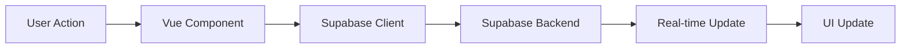

# Views (Astro + Vue.js + Supabase Integration)

This directory contains the documentation for all views in the Pokemon Card Marketplace project. Each view is built using Astro with Vue.js components and integrates directly with Supabase for backend functionality.

## List of Views

### Public Views (No Authentication Required)
*   [Home](home.view.yaml) - Landing page with featured cards and marketplace highlights
*   [Register](register.view.yaml) - User registration with Supabase Auth integration
*   [Login](login.view.yaml) - Authentication using Supabase Auth
*   [Password Recovery](password_recovery.view.yaml) - Password reset via Supabase Auth
*   [Card Catalog](card_catalog.view.yaml) - Browse cards with PostgreSQL queries
*   [Card Details](card_details.view.yaml) - Detailed card view with Supabase Storage images
*   [Cards for Sale List](cards_for_sale_list.view.yaml) - Public marketplace listings

### Authenticated Views (Supabase Auth Required)

#### Shopping & Transactions
*   [Cart](cart.view.yaml) - Shopping cart with RLS-secured user data
*   [Purchase](purchase.view.yaml) - Purchase flow with Edge Function payment processing
*   [Purchase History](purchase_history.view.yaml) - Transaction history with RLS policies
*   [Purchase List](purchase_list.view.yaml) - Purchase management interface
*   [Purchase Details](purchase_details.view.yaml) - Individual purchase details
*   [Purchased Cards List](purchased_cards_list.view.yaml) - Buyer's card history

#### Selling & Marketplace
*   [Sell](sell.view.yaml) - Create sale listings with Supabase Storage upload
*   [Sales History](sales_history.view.yaml) - Seller transaction history
*   [Sales List](sales_list.view.yaml) - Manage active sale listings
*   [Sales Details](sales_details.view.yaml) - Individual sale details
*   [Sold Cards List](sold_cards_list.view.yaml) - Seller's card history

#### User Profile & Account
*   [User Profile](user_profile.view.yaml) - Personal profile with Supabase Storage avatars
*   [Edit User Profile](edit_user_profile.view.yaml) - Profile editing with image upload
*   [Other User Profile](other_user_profile.view.yaml) - Public user profiles
*   [Balance](balance.view.yaml) - Account balance management
*   [Recharge Balance](recharge_balance.view.yaml) - Payment processing via Edge Functions

#### Collection Management
*   [Collection](collection.view.yaml) - Personal card collection with RLS security
*   [Collection Details](collection_details.view.yaml) - Detailed collection management

#### Messaging (Supabase Realtime)
*   [Private Messages](private_messages.view.yaml) - Real-time messaging interface
*   [Private Message Details](private_message_details.view.yaml) - Individual message view

## Supabase Integration Features

### Authentication Integration
- **Supabase Auth**: Seamless login/logout across all views
- **Session Management**: Automatic JWT token handling
- **Protected Routes**: Authentication guards for private views
- **User Context**: Global user state management

### Real-time Features
- **Live Messaging**: Instant message updates in messaging views
- **Inventory Updates**: Real-time stock changes in catalog views
- **Cart Synchronization**: Multi-device cart state management
- **Notifications**: Live transaction and activity updates

### Data Security
- **Row Level Security**: All user data protected by RLS policies
- **Role-based Access**: Different UI elements based on user roles
- **Data Isolation**: Users only see their own private data
- **Secure File Access**: Images served through Supabase Storage with access control

### Performance Optimization
- **Pagination**: Efficient data loading for large datasets
- **Caching**: Smart caching of frequently accessed data
- **Optimistic UI**: Immediate feedback for user actions
- **Image Optimization**: Automatic image resizing and format conversion

## View Architecture

### Component Structure
```
View (Astro Component)
├── Layout Components
├── Feature Components (Vue.js)
│   ├── Supabase Client Integration
│   ├── Real-time Subscriptions
│   └── State Management
└── Shared UI Components
```

### Data Flow


### State Management
- **Local State**: Vue.js reactivity for component state
- **Global State**: Pinia stores for shared application state
- **Server State**: Supabase client for server-side data
- **Real-time State**: Supabase Realtime for live updates

## Development Guidelines

### Supabase Client Usage
```javascript
// Example: Authentication in a Vue component
import { supabase } from '@/lib/supabase'

// Login
const { data, error } = await supabase.auth.signInWithPassword({
  email: 'user@example.com',
  password: 'password'
})

// Real-time subscription
supabase
  .channel('messages')
  .on('postgres_changes', { 
    event: 'INSERT', 
    schema: 'public', 
    table: 'messages' 
  }, handleNewMessage)
  .subscribe()
```

### Security Best Practices
- Always use RLS policies for data access
- Validate user permissions in components
- Sanitize user inputs before database operations
- Use Supabase Storage for secure file handling

### Performance Best Practices
- Implement pagination for large data sets
- Use Supabase's automatic caching features
- Optimize images through Supabase Storage
- Implement optimistic UI updates for better UX

## Testing Strategy

### Component Testing
- Unit tests for Vue.js components
- Mock Supabase client for isolated testing
- Test authentication flows and protected routes

### Integration Testing
- E2E tests with real Supabase test environment
- Test real-time functionality and data synchronization
- Validate RLS policies and data access controls

### User Experience Testing
- Test responsive design across devices
- Validate accessibility features
- Test real-time features under load
