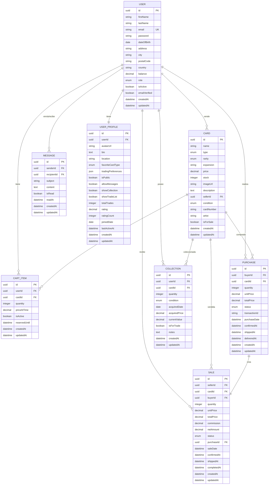

# Entidades del Sistema

Las entidades representan los modelos de datos principales del sistema Pokemon Card Marketplace. Cada entidad define la estructura, propiedades y relaciones de los objetos que maneja la aplicación.

## 📋 Lista de Entidades

| Entidad | Archivo | Descripción |
|---------|---------|-------------|
| **Usuario** | [user.entity.md](./user.entity.md) | Usuarios del sistema (compradores, vendedores, admins) |
| **Carta** | [card.entity.md](./card.entity.md) | Cartas Pokemon disponibles para intercambio |
| **Mensaje** | [message.entity.md](./message.entity.md) | Mensajes privados entre usuarios |
| **Compra** | [purchase.entity.md](./purchase.entity.md) | Transacciones de compra realizadas |
| **Venta** | [sale.entity.md](./sale.entity.md) | Transacciones de venta realizadas |
| **Colección** | [collection.entity.md](./collection.entity.md) | Colecciones de cartas de usuarios |
| **Carrito** | [cart_item.entity.md](./cart_item.entity.md) | Elementos en carritos de compra |
| **Perfil** | [user_profile.entity.md](./user_profile.entity.md) | Información extendida del perfil de usuario |

## 🔗 Relaciones entre Entidades

## 🎯 Decisiones Clave de Diseño

### 1. **Separación de entidades Purchase y Sale**
- **Purchase**: Rastrea la perspectiva del comprador y el flujo de pago
- **Sale**: Rastrea la perspectiva del vendedor y el manejo de comisiones
- **Relación**: Cada Purchase crea un Sale correspondiente

### 2. **Separación entre Collection y Cart**
- **Collection**: Propiedad a largo plazo de cartas
- **CartItem**: Carrito de compras temporal con expiración

### 3. **Extensión del Perfil de Usuario**
- **User**: Datos principales de autenticación y negocio
- **UserProfile**: Características sociales y preferencias

### 4. **Modelo de Propiedad de Cartas**
- Las cartas pertenecen a vendedores (sellerId)
- Las colecciones rastrean la propiedad del usuario por separado
- Flexible para diferentes modelos de negocio

## 📝 Convenciones de Nomenclatura

### Archivos
- Patrón: `{entity_name}.entity.yaml`
- Usar minúsculas con guiones bajos para entidades multi-palabra

### Campos
- Usar `camelCase` para nombres de campos
- Claves primarias: `id` (UUID)
- Claves foráneas: `{entity}Id`
- Timestamps: `createdAt`, `updatedAt`
- Booleanos: `is{Property}`, `has{Property}`, `allow{Property}`

### Enums
- Usar `PascalCase` con guiones bajos para valores multi-palabra
- Ejemplo: `Near_Mint`, `Ultra_Rare`

## ✅ Estándares de Validación

Todas las entidades incluyen:
- ✅ Clave primaria (UUID)
- ✅ Validación de campos requeridos
- ✅ Restricciones de tipo de datos
- ✅ Documentación de reglas de negocio
- ✅ Definiciones de relaciones
- ✅ Índices apropiados
- ✅ Timestamps para auditoría

## 📋 Resumen de Reglas de Negocio

### Seguridad y Privacidad
- Verificación de email requerida para vender
- Sanitización del contenido de mensajes
- Controles de visibilidad del perfil
- Rastreo de actividad del usuario

### Lógica de Intercambio
- Validación de stock para compras
- Congelación de precios en carrito
- Cálculo de comisiones para ventas
- Progresión automática de estados

### Integridad de Datos
- Restricciones únicas donde se necesite
- Integridad referencial con claves foráneas
- Políticas de eliminación en cascada
- Pistas de auditoría con timestamps

## 🛠️ Guías de Uso

1. **Desarrollo**: Usar estas entidades como fuente de verdad para el esquema de base de datos
2. **Diseño de API**: Mapear campos de entidades a endpoints de API
3. **Validación**: Implementar reglas de negocio como validadores de aplicación
4. **Testing**: Crear fixtures de prueba basados en definiciones de entidades
5. **Documentación**: Mantener documentos de entidades actualizados con cambios de esquema

!!! info "Estructura de Datos"
    Cada archivo de entidad define la estructura usando YAML, incluyendo campos, tipos de datos, validaciones y relaciones con otras entidades.

!!! tip "Desarrollo TDD"
    Estas entidades sirven como base para la generación automática de modelos, validaciones y tests en el desarrollo TDD.
